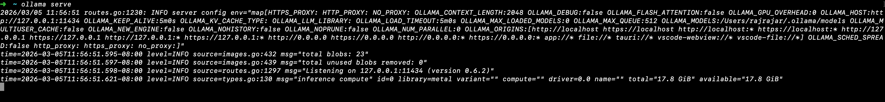
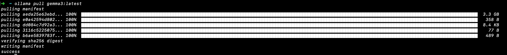
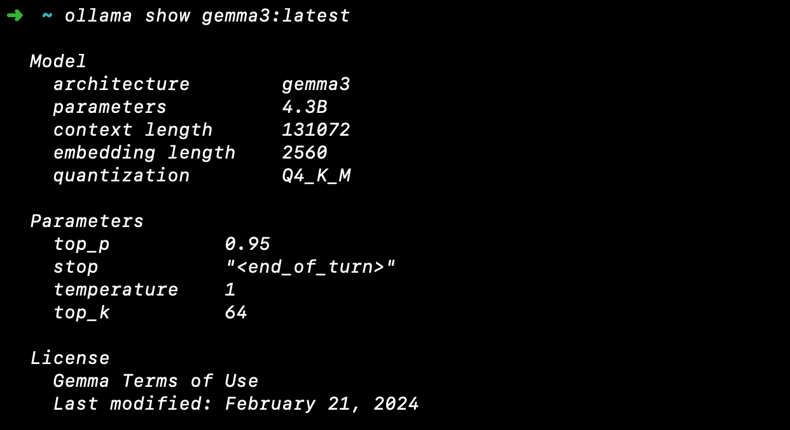
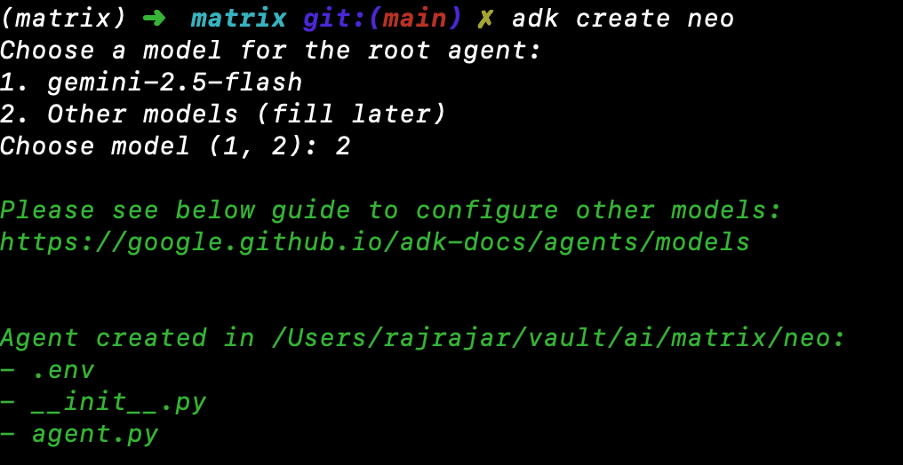

As I started to build agentic applications, I immediately stumbled upon couple of obstacles. First, the obvious one, is that I kept running low on funds and credits at a faster pace. Second, I had no quicker way to quickly setup and test applications locally. On the positive side, these hurdles helped me explore Ollama. For those of us who have used docker in the past, it had a similar commands to get started and up and running. 

Why Ollama?

In docker parlance, ollama is the cli or the application that you install locally. The website `https://ollama.com/library` is equivalent to the dockerhub. For the uninitiated, ollama cli is what you run as commands from the terminal and the website has open sources models available for us to explore and even create new ones and share with the world. To explore a model, you download the model to your machine, start it in your device and interact with it locally. Once a model is downloaded, then it can started and interacted offline without any other dependencies. 

The output of the model is dependent on the model, quantization and training parameters etc. 

Visit ollama.com to install and to fire up ollama in our machine.

Commands

The most frequent ones that I use are `ollama serve`, `ollama pull` and `ollama run`. In addition I use `ollama show` and occasionally `ollama create` to tune models with additional parameters. The youtube video series explain its featues in detail. 

In our example today, we are going to create a simple adk agent that is capable of calling a tool and the model is served by ollama in our machine. 

We will explore these command and their use case as we go along. 

Agentic Development Kit

Google's ADK is a framework for development of agents. I personally like ADK and Langgraph and hence chose ADK. If you have other frame work it should still work the same. 

Lets get started.


Bringing up our model

Ollama on installation adds tool icon for ease of access. I prefer to start is via cli to monitor the logs. You can use the app or the `ollama serve` command.



As you can see the terminal is taken over and we can see some logs. Lets ignore them for now. 

In a seperate terminal, lets start our model. In this case we are going to work with google gemma model. You can choose any model of your liking. 

`ollama pull` download the model locally. `ollama run` will download and run the model in a single command. Lets go in steps and pull the model 



Now lets see the model infromation with `ollama show`. 




Finally lets run the model with `ollama run`. 

You can type in to chat and type `/bye` to stop the model. 

Whoo! We got a model running in local machine with a handful of commands. 


Create an Agent with out model 

We are using python with the `uv` package manager to get started. 

`uv init matrix` 


The generated file `pyproject.toml` has the dependecies listed. 

Navigate to the created folder and add the  ADK dependency by the command `uv add google-adk`

`source .venv/bin/activate` 

`adk create neo` 



Navigate to the created folder Neo. LLMLite  provides a OpenAI compliant wrapper for integrating models. 

`uv add litellm`


The `neo\agent.py` has the below content.

```
from google.adk.agents.llm_agent import Agent

root_agent = Agent(
    model='<FILL_IN_MODEL>',
    name='root_agent',
    description='A helpful assistant for user questions.',
    instruction='Answer user questions to the best of your knowledge',
)
```

Replace it with this content. 

```
from google.adk.agents.llm_agent import Agent
from google.adk.models.lite_llm import LiteLlm

root_agent = Agent(
    model=LiteLlm(model="ollama_chat/gemma3-with-tools:latest"),
    name='root_agent',
    description='A helpful assistant for user questions.',
    instruction='Answer user questions to the best of your knowledge',
)
```

Thats it. We have created an agent with ollama running locally. Now is the time to fire up our agent. 


Go Neo

``` bash
(matrix) ➜  matrix git:(main) ✗ adk run neo 
Log setup complete: /var/folders/9y/3hf9sy4n28j746tb3y8kfcy40000gp/T/agents_log/agent.20260305_134818.log
To access latest log: tail -F /var/folders/9y/3hf9sy4n28j746tb3y8kfcy40000gp/T/agents_log/agent.latest.log
/vault/ai/matrix/.venv/lib/python3.13/site-packages/google/adk/cli/cli.py:204: UserWarning: [EXPERIMENTAL] InMemoryCredentialService: This feature is experimental and may change or be removed in future versions without notice. It may introduce breaking changes at any time.
  credential_service = InMemoryCredentialService()
/vault/ai/matrix/.venv/lib/python3.13/site-packages/google/adk/auth/credential_service/in_memory_credential_service.py:33: UserWarning: [EXPERIMENTAL] BaseCredentialService: This feature is experimental and may change or be removed in future versions without notice. It may introduce breaking changes at any time.
  super().__init__()
Running agent root_agent, type exit to exit.
[user]: Is the matrix real? Give a short answer 
13:48:32 - LiteLLM:INFO: utils.py:3898 - 
LiteLLM completion() model= gemma3:latest; provider = ollama_chat
[root_agent]: As a thought experiment, yes, the Matrix is real in the sense that a simulated reality could exist. However, in the literal, physical sense, no – it’s a fictional construct. 

root_agent

[user]: 

```

Conclusion

We have created a simple yet powerful agent with ollama running in out local machine. There are a multitude of options available in ollama and adk to create powerful and amazing agent. Lets explore ollama and adk in details in the subsequent blogs. 


Note: The content is passed to a LLM to polish and vet for grammatical corrections. 

Reference

[1] https://www.youtube.com/playlist?list=PLvsHpqLkpw0fIT-WbjY-xBRxTftjwiTLB

[2] https://www.youtube.com/watch?v=qqN63hbziaI&t=90s

[3] https://rentry.org/quants