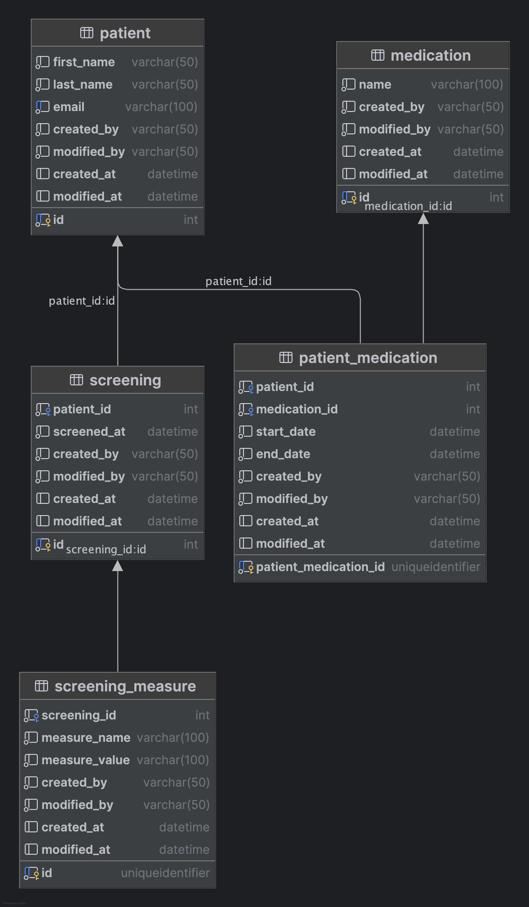

## The Versioned State Machine

In a typical CRUD application, an update is a simple overwrite. But in high-compliance environments, an update is a journey. Recently, I tackled a requirement where a domain record governed by a state machine needed to maintain multiple versions simultaneously.

The challenge arises when an update isn't immediately "authoritative." Instead, the new version must navigate a series of states—often involving external system handshakes—before it can replace the previous version in the user's primary view.

### The Constraints

Dual Visibility: The user must continue to see the "Current Truth" while a "New Truth" is being processed.

Update Locking: To prevent race conditions and data corruption, no further modifications can be allowed while an update is pending.

Strict Auditability: Every transition, even the failed intermediate ones, must be immutable and retrievable.

#### Why Not Event Sourcing?
When auditability is a top priority, Event Sourcing is often the first suggestion. However, for many small-to-medium applications, the operational complexity and "mental tax" of event sourcing can outweigh the benefits.

Instead, I implemented a pattern using Temporal Tables and Versioned Writes. This provides the "time-travel" capabilities of event sourcing with the simplicity of a relational model.

### Core Implementation Patterns
#### 1. Hexagonal Architecture with jMolecules
To keep the domain logic pure and isolated from external API complexities (like EHR/EMR integrations), I used a Hexagonal (Ports & Adapters) approach. jMolecules helps enforce these boundaries, ensuring the state machine logic doesn't leak into the persistence or web layers.

#### 2. The Versioned Write Pattern
Instead of updating the existing row, we treat an update as a new record creation. This record "navigates" the state machine:

Draft/Pending: The record is created and visible as "In Progress."

External Transition: Control passes to an external system (via a Transactional Outbox).

Terminal State: Upon confirmation, the new record is marked as authoritative.

#### 3. Visibility Logic
The user view is managed by a specific query strategy:

Active View: Fetch the latest record in a FINAL state.

Pending View: Fetch any record in a TRANSITIONING state.

UI Constraint: If a pending record exists, the UI disables "Edit" functionality and displays an "Update in Progress" banner.

### Practical Example: Patient Information Management
Consider a system managing patient data that must be synchronized with an external Electronic Health Record (EHR).

#### Data Model
The below relational model will be used to explain the problem.

`Patient` Customer profile information

`Medications` Master list of medications.

`Patient_Medications` Set of medications a patient is using.

`Screenings` The screening date of the customer

`Screening_Measure` The mesure of user vitals on a particular screening

### Implementation

#### 1. The Data Model & Audit Layer
By combining Hibernate Envers with SQL Server Temporal Tables, we create a robust audit trail.

Envers tracks the intent (application-level revisions).

Temporal Tables track the state (database-level row history).

#### 2. The State Machine Flow
Instead of updating the existing Patient record, we create a new version with a PENDING status.

Transition 1 (Internal): The user submits info; the state moves to REVIEW_PENDING.

Transition 2 (External): Control passes to the EHR system via a Transactional Outbox.

Transition 3 (Terminal): Once the EHR confirms, the state hits FINAL, and this version becomes the new "Authoritative" record.

#### 3. Managing the User Interface
The "Visibility Constraint" is handled at the query level. The UI fetches two distinct views:

The Authoritative View: The latest record where Status = 'FINAL'.

The Progress Indicator: If a record exists where Status != 'FINAL', the UI flags the record as "Read-Only" and shows the pending changes.

| Pattern	| Role in the Solution | 
|-----------|----------------------|
|Hexagonal Architecture	| Keeps the complex EHR API logic (Adapters) away from the core Patient logic|
|Transactional Outbox	| Ensures that state transitions and external API triggers stay atomic|
|Versioned Write	    | Prevents data loss by treating every update as a new entity until validated|
|Temporal Tables        | Automatic database-level history without manual audit tables|
|State Machine          | Explicitly defines the lifecycle of a versioned record|
